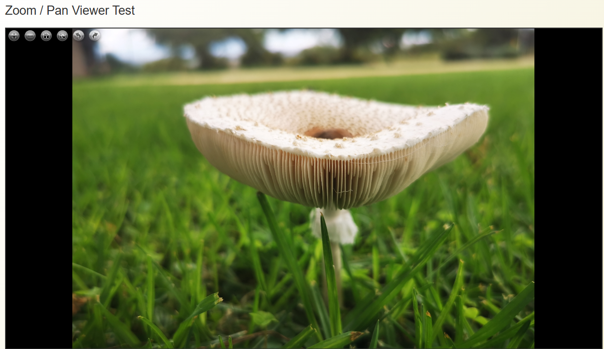

# arZoomPan Plugin for AtoM

## Overview

The arZoomPan plugin provides advanced document viewing capabilities for AtoM (Access to Memory), including zoom, pan, and rotate functionality similar to IIIF viewers. It supports images, PDFs, and text documents.

<p align="center">
  
</p>

## Features

- **Image Viewer**: Deep zoom with tile-based loading for large images
- **PDF Viewer**: Page navigation with zoom and pan for PDF documents  
- **Text Viewer**: Zoomable text display for documents (TXT, DOC, DOCX, ODT)
- **Universal Controls**: Zoom in/out, pan, rotate, fullscreen mode
- **Keyboard Shortcuts**: Navigation using keyboard commands
- **Mobile Responsive**: Touch gestures for mobile devices
- **Caching**: Tile caching for improved performance
- **Download**: Direct download of original files

## Requirements

- AtoM 2.x (tested with 2.9)
- PHP 7.4+ or PHP 8.x
- ImageMagick (for image processing)
- Pandoc (optional, for document conversion)
- pdfinfo (for PDF page counting)

## Installation

### 1. Copy Plugin Files

```bash
# Copy the plugin to your AtoM plugins directory
sudo cp -r /mnt/user-data/outputs/arZoomPanPlugin /usr/share/nginx/atom/plugins/

# Set proper permissions
sudo chown -R www-data:www-data /usr/share/nginx/atom/plugins/arZoomPanPlugin
sudo chmod -R 755 /usr/share/nginx/atom/plugins/arZoomPanPlugin
```

### 2. Enable the Plugin

Add to your AtoM configuration file (`config/ProjectConfiguration.class.php`):

```php
public function setup()
{
  $this->enablePlugins(array(
    // ... other plugins
    'arZoomPanPlugin'
  ));
}
```

### 3. Clear Cache

```bash
cd /usr/share/nginx/atom
sudo -u www-data php symfony cc
```

### 4. Install Dependencies

```bash
# Install ImageMagick if not already installed
sudo apt-get install imagemagick

# Install Pandoc for document conversion (optional)
sudo apt-get install pandoc

# Install poppler-utils for PDF info
sudo apt-get install poppler-utils
```

### 5. Create Cache Directory

```bash
# Create cache directory for tiles
sudo mkdir -p /usr/share/nginx/atom/uploads/zoompan-cache
sudo chown www-data:www-data /usr/share/nginx/atom/uploads/zoompan-cache
sudo chmod 755 /usr/share/nginx/atom/uploads/zoompan-cache
```

## Configuration

### Plugin Settings

Edit the plugin configuration in `arZoomPanPluginConfiguration.class.php`:

```php
$settings = array(
  'enable_pdf_viewer' => true,        // Enable PDF viewing
  'enable_text_viewer' => true,       // Enable text document viewing
  'enable_image_viewer' => true,      // Enable image viewing
  'tile_size' => 256,                 // Tile size in pixels
  'max_zoom_level' => 10,             // Maximum zoom level
  'cache_tiles' => true,              // Enable tile caching
  'cache_directory' => sfConfig::get('sf_upload_dir') . '/zoompan-cache',
  'supported_formats' => array('jpg', 'jpeg', 'png', 'gif', 'tif', 'tiff', 'pdf', 'txt', 'doc', 'docx', 'odt')
);
```

### ImageMagick Limits

For large images, you may need to adjust ImageMagick limits:

```bash
sudo nano /etc/ImageMagick-6/policy.xml
```

Update these values:
```xml
<policy domain="resource" name="memory" value="2GiB"/>
<policy domain="resource" name="map" value="4GiB"/>
<policy domain="resource" name="width" value="32KP"/>
<policy domain="resource" name="height" value="32KP"/>
<policy domain="resource" name="area" value="1GB"/>
```

## Usage

### In Templates

To use the viewer in your AtoM templates:

```php
<?php if ($digitalObject): ?>
  <div class="zoom-pan-container" 
       data-digital-object-id="<?php echo $digitalObject->id ?>"
       data-viewer-type="<?php echo $viewerType ?>">
    <!-- Viewer will be initialized here -->
  </div>
<?php endif; ?>
```

Or include the viewer partial:

```php
<?php include_partial('arZoomPan/viewer', array(
  'resource' => $digitalObject,
  'viewerType' => 'auto' // auto-detect based on mime type
)) ?>
```

### JavaScript API

Initialize viewer programmatically:

```javascript
$('#my-viewer').zoomPanViewer({
  digitalObjectId: 123,
  viewerType: 'image',
  maxZoom: 20,
  enableRotation: true,
  enableFullscreen: true
});

// Control viewer
var viewer = $('#my-viewer').data('zoom.pan.viewer');
viewer.zoomIn();
viewer.zoomOut();
viewer.resetView();
viewer.rotateLeft();
viewer.rotateRight();
```

### Keyboard Shortcuts

- `+` or `=`: Zoom in
- `-`: Zoom out
- `0`: Reset view
- `Ctrl+←`: Rotate left
- `Ctrl+→`: Rotate right
- `←`: Previous page (PDF)
- `→`: Next page (PDF)
- `Ctrl+F`: Fullscreen

## API Endpoints

The plugin provides these endpoints:

- `/zoompan/info/{id}` - Get document information
- `/zoompan/tile/{id}/{z}/{x}/{y}.{format}` - Get image tile
- `/zoompan/pdf/{id}/{page}` - Get PDF page as image
- `/zoompan/text/{id}` - Get text document as HTML

## Customization

### Styling

Override styles in your theme CSS:

```css
/* Custom toolbar color */
.zoom-pan-toolbar {
  background: #your-color;
}

/* Custom viewer height */
.zoom-pan-viewer {
  height: 800px !important;
}

/* Hide navigator */
.zoom-pan-navigator {
  display: none;
}
```

### Extending Functionality

Create custom handlers:

```javascript
$(document).on('zoom-pan:loaded', function(e, viewer) {
  // Custom initialization
});

$(document).on('zoom-pan:zoom', function(e, level) {
  console.log('Zoom level:', level);
});

$(document).on('zoom-pan:page-change', function(e, page) {
  console.log('PDF page:', page);
});
```

## Performance Optimization

### Tile Caching

Tiles are automatically cached. To clear cache:

```bash
sudo rm -rf /usr/share/nginx/atom/uploads/zoompan-cache/*
```

### Pre-generate Tiles

For better performance, pre-generate tiles:

```bash
cd /usr/share/nginx/atom
sudo -u www-data php symfony zoom-pan:generate-tiles --digital-object-id=123
```

## Troubleshooting

### Images Not Loading

1. Check file permissions:
```bash
ls -la /usr/share/nginx/atom/uploads/
```

2. Check ImageMagick:
```bash
convert -version
```

3. Check error logs:
```bash
tail -f /var/log/nginx/error.log
```

### PDF Not Displaying

1. Check poppler-utils:
```bash
pdfinfo --version
```

2. Verify PDF is not corrupted:
```bash
pdfinfo /path/to/file.pdf
```

### Performance Issues

1. Increase PHP memory limit:
```bash
sudo nano /etc/php/8.3/fpm/php.ini
# Set memory_limit = 512M
```

2. Enable OPcache:
```bash
opcache.enable=1
opcache.memory_consumption=256
```

## Integration with Existing Themes

### For Bootstrap 5 Themes

```php
// In your theme's digitalobject/indexSuccess.php
<?php use_helper('arZoomPan') ?>

<div class="digital-object-container">
  <?php echo get_zoom_pan_viewer($resource, array(
    'class' => 'mb-4',
    'height' => '700px'
  )) ?>
</div>
```

### For Default Theme

```php
// In apps/qubit/modules/digitalobject/templates/showSuccess.php
<?php if ($resource->canAccess()): ?>
  <?php include_component('arZoomPan', 'viewer', array(
    'resource' => $resource
  )) ?>
<?php endif; ?>
```

## License

This plugin is open source and follows the same license as AtoM.

## Support

For issues or questions:
- Create an issue on GitHub
- Contact: johan@theahg.co.za

## Credits

- OpenSeadragon for deep zoom functionality
- PDF.js for PDF rendering
- ImageMagick for image processing
- Pandoc for document conversion

## Version History

- 1.0.0 - Initial release
  - Image viewer with tiling
  - PDF viewer with page navigation
  - Text document viewer
  - Zoom, pan, rotate functionality
  - Mobile responsive design
